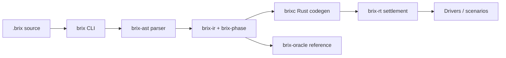

# BrixMS

[](https://github.com/tbreijm/brixms/actions/workflows/ci.yml)
[](https://github.com/tbreijm/brixms/releases)
[](./LICENSE)

**A typed language in which a program is an executable model of a world.**

Durable state is a versioned, typed hypergraph; dynamics are pure derivation
rules settled deterministically to a fixpoint at each revision; the model couples
to reality only through explicit boundaries — with identical settlement semantics
under scenario-bound and production-bound boundaries.

## Philosophy

BrixMS starts from one thesis: **software is a simulation model of reality**,
and the model is the program — not something buried under objects, threads,
queues, and callbacks until it has to be reverse-engineered back out of the
code. A few principles follow:

- **The model *is* the program.** You declare what exists, what follows, what
  is asked, and where the model meets the world — not the machinery that keeps
  those in sync.
- **Computation is settlement.** Every committed change runs the program's
  derivation rules to their least fixpoint before it is observable; nothing is
  half-derived.
- **Time is versioning.** State is never mutated in place; it advances as an
  ordered sequence of committed revisions, so history and replay are
  properties of the data, not bolted-on logging.
- **Development is simulation; production is coupled simulation.** The same
  rules and settlement semantics run whether boundary facts come from a
  scripted test scenario or a real Driver — no separate mocking layer to
  drift out of sync with production.
- **The system always maintains a model of itself.** Schema, rules, and
  provenance are sealed relations you can query in-language — "why does this
  exist" is a stock query (`brix why`), not archaeology.
- **Effective, not complete.** No totality proofs or exact-arithmetic
  theatre; the model fails closed and makes every conflict explicit. There is
  never a silent winner.

> Everything durable, observable, explainable, and interactively meaningful is a
> relation. Computation is settlement. Time is versioning. Intelligence is typed
> by its epistemic status. Components are context-independent semantic bricks.
> The system always maintains a model of itself.

## The problem

Most stacks let the model disappear — a domain concept starts as a class and
ends up smeared across a database schema, a service layer, a queue consumer,
and a frontend store, until no single file tells you what the system actually
believes is true. Specifically:

- **Tests drift from production.** Hand-built mocks model the outside world
  separately from how the real system talks to it, and the two diverge.
- **Conflicts resolve silently.** Last-write-wins, hash order, and source
  priority hide that two writers disagreed — until it matters.
- **Provenance is opaque.** "Why does this row exist" usually means grepping
  logs, not asking the system.
- **Effects are ambient.** Code reaches the network, filesystem, or an AI
  model with no typed, scoped record that it was allowed to.

BrixMS collapses these into one composable executable model: not a frontend
framework wired to a backend service with an AI layer bolted on, but a single
typed hypergraph whose rules, boundaries, and history are all queryable in the
same language.

## How it works

A BrixMS **package** is a `brix.toml` manifest plus a `src/world.brix` source
file — the entrypoint's name echoes "a program models a world." `world.brix`
declares the package, then the shapes that exist and the scenarios that
exercise them:

```brix
package demo.widgets @ 0.1.0
module Widgets

entity Widget {
  key code: String
}

scenario Smoke {
  seed 1
  assert at end { true }
}
```

- **Entities and rels** are the two durable kernel primitives — nodes and
  typed-role edges. Everything else (revisions, rules, provenance) is built
  from the same two primitives under sealed schemas.
- A package can grow beyond one file: any sibling `src/<name>.brix` is a real
  submodule, published under the package-qualified path `pkg.<name>` (e.g.
  `src/order.brix` in `brix.math` becomes `brix.math.order`, reachable via
  `use brix.math.order.{…}` or a bare call from inside the same package).
  `world.brix` is the only file allowed to declare `package NAME @ VERSION`.
- **Settlement**: on every committed revision, the compiler resolves the rule
  dependency graph into phases and derives the least fixpoint of the program's
  rules over the base facts. A revision is published fully settled or not at
  all — there is no partially-derived state to observe.
- **Boundaries**: `scenario`s (development/tests) and `driver`s (production)
  feed the same protocols under the same settlement semantics; switching one
  for the other changes zero lines of model code.



This repository is the **Ring 0 toolchain** — the small, trusted core that
implements all of the above: canonical encoding, parser, Core IR + typechecker,
a naive reference oracle used as the semantic ground truth, the runtime, `brixc`
Rust codegen, the `brix` CLI, the package manager, and the Driver SDK. Everything
else in the language — standard library, domain packages, Drivers — is, by the
spec's own layer rules, ordinary BrixMS packages built on these tools (Ring 1),
published and versioned the same way any package under [`packages/`](./packages)
is. The full worked example (a logistics "flagship" program) lives in Part I of
[`spec/BrixMS_v9_0.md`](./spec/BrixMS_v9_0.md).

### Layout

```
crates/
  brix-canon        canonical encoding + identity (App. G) — frozen first (G0)
  brix-diag         diagnostic types, BRX codes, JSON/SARIF
  brix-ast          lexer, hand-written parser, CST/AST, spans, fmt
  brix-ir           types, effects, traits, Core IR, checking
  brix-phase        dependency graph, SCC, phase assignment (App. F)
  brix-oracle       naive reference evaluator — the semantic authority (G1)
  brix-rt           runtime: revisions, deltas, provenance, sim clock, WASM host
  brixc             pipeline + Rust codegen
  brixpkg           manifest, lockfile, resolve, local registry
  brix-cli          the `brix` binary — check/fmt/build/run/test/quality today
  brix-conformance  fixture format, CONF runner, differential harness, fuzzer
sdk/
  driver-wit        WIT worlds: delta ABI + host capabilities
  brix-driver-rs    Rust guest SDK for WASM Drivers
vectors/            frozen canon golden vectors (Day-1 artifact, G0)
spec/               the v9.0 normative specification + build plans + errata/
packages/           Ring 1 standard-library packages (brix.core, brix.math, ...)
```

## Status

**Pre-G0 alpha.** The current pre-release is
**[v0.1.0-alpha.1](https://github.com/tbreijm/brixms/releases/tag/v0.1.0-alpha.1)**
— the Ring 0 foundation. The canonical encoding is frozen and the core kernels
(parser + idempotent `brix fmt`, Core IR + checks, the reference oracle, the
runtime substrate, and the package manager) are in place and tested. **APIs
are unstable.** `brix check`, `brix fmt`, `brix build`, and `brix run` work
against real packages today; `brix test` and `brix quality` run the compiler
checks and then execute a small, explicit subset of the full language (see
[Current limits](#current-limits) below) rather than silently passing on what
they can't yet verify. This is not yet a complete language product — progress
is measured by gate, not date (see [Gates, not dates](#gates-not-dates)); open
spec questions awaiting a ruling live in [`spec/errata/`](./spec/errata).

## Installation

**Prerequisites:** Rust **1.96.1**, pinned in
[`rust-toolchain.toml`](./rust-toolchain.toml) (`rustup` will install it
automatically the first time you build). Nothing else is required for the core
toolchain.

There is no published crate or prebuilt binary yet — build from source:

```bash
git clone https://github.com/tbreijm/brixms.git
cd brixms
cargo build --workspace          # builds every crate
cargo build -p brix-cli          # just the CLI, at ./target/debug/brix
```

To run the full test/lint suite the same way CI does:

```bash
cargo test  --workspace
cargo fmt --all --check
cargo clippy --workspace --all-targets -- -D warnings
```

Determinism is enforced mechanically, not just documented: `HashMap`/`HashSet`
are clippy-denied in semantic code paths (`clippy.toml`), `unsafe` is denied
workspace-wide, and the Rust toolchain itself is pinned — two-machine
reproducibility is a release gate (G3).

## Using the CLI

Every example below runs against [`packages/brix.core`](./packages/brix.core),
one of the minimal stub packages already checked into this repo.

```bash
brix=./target/debug/brix

$brix check packages/brix.core
# brix: checked packages/brix.core/src/world.brix

$brix fmt packages/brix.core
# package brix.core @ 0.1.0
# module Core

$brix build packages/brix.core
# brix: built packages/brix.core/.brix-cache/<hash>/target/debug/brix_core

$brix run packages/brix.core
# brix: generated workspace OK

$brix quality packages/brix.core --profile standard
# brix: quality standard passed for packages/brix.core/src/world.brix
```

`build` and `run` generate a Rust workspace under a content-addressed
`.brix-cache/<hash>/` directory and compile it with `cargo build --offline`;
repeat runs are cache hits. Add `--diagnostic-format json` or `--diagnostic-format
sarif` to any of `check`/`fmt`/`test`/`quality`/`build`/`run` for structured,
timestamp-free output. Exit codes are consistent everywhere: `0` success, `1`
build/runtime/quality failure, `2` command-line usage error.

`brix test` executes scenarios declared in a package. `packages/brix.core` has
none yet (it's a stub), so run it against the `demo.widgets` package shown
above instead:

```bash
$brix test path/to/demo.widgets
# brix: 1 scenarios (1 assertions) passed for path/to/demo.widgets/src/world.brix
```

### Current limits

- **`brix test`** only executes scenarios with one fixed `seed`, no
  `setup`/`step`/`at` blocks, and Boolean-only `assert at end` assertions.
  Anything outside that subset — including against `packages/brix.core`,
  which declares no scenarios at all — fails closed with `BRX-TEST-0001` and
  structured evidence rather than a false pass. Full rules: [`crates/brix-cli/TEST_SCENARIOS.md`](./crates/brix-cli/TEST_SCENARIOS.md).
- **`brix quality`** has four cumulative profiles (`prototype < standard <
  production < critical`). Most `production`/`critical` rules are not
  implemented yet and report `BRX-QUALITY-0003` ("unavailable"), never a
  false pass. Full rules: [`crates/brix-cli/QUALITY_PROFILES.md`](./crates/brix-cli/QUALITY_PROFILES.md).
- **Package dependencies** declared in `brix.toml` are accepted by `brixpkg`'s
  manifest/lockfile logic but not yet resolved by `brix build`/`brix run` —
  keep `[dependencies]` empty for now.
- **Only `check`, `fmt`, `build`, `run`, `test`, and `quality` are
  implemented.** Other verbs referenced in the spec and CLI help (`new`,
  `repl`, `sim`, `why`, `whynot`, `explain`) print "not yet implemented."

A separate, optional local coding-agent tool for developing Brix packages
lives in [`tools/brix-builder/`](./tools/brix-builder) (Python, Apple Silicon
+ MLX) — see its own [README](./tools/brix-builder/README.md) for setup; it is
not required to build or use the core toolchain above.

## Origin & license

BrixMS grows out of the original open-source Brix work published at
**[tbreijm/tbreijm.github.io](https://github.com/tbreijm/tbreijm.github.io)** —
the "detect–execute" collision-loop formalism whose production form is the
incidence index at the heart of this runtime. This project continues that line
in the open: it is licensed **[Apache-2.0](./LICENSE)** and developed entirely
through the public toolchain and published formats, so the containment the spec
promises production is the containment the build itself runs under.

## The plan

- `spec/BrixMS_v9_0.md` — the normative language specification (v9.0).
- `spec/Ring0_Build_Plan.md` — crates, decisions, order, gates for this repo.
- `spec/Build_Plan_v2.md` — the two-ring "toolchain first" strategy.
- `CONTRIBUTING.md` — the feedback protocol (package bug / toolchain bug / spec
  erratum) and the determinism discipline every change is held to.

## Gates, not dates

```
G0  canon golden vectors frozen, independently cross-checked
G1  flagship runs end-to-end on the oracle; oracle freezes
G2  engine = oracle, conformance-green under sustained fuzz
G3  flagship deterministic on two machines; backend parity
G4  Developer Day: a fresh agent ships a package with public tools only
```
