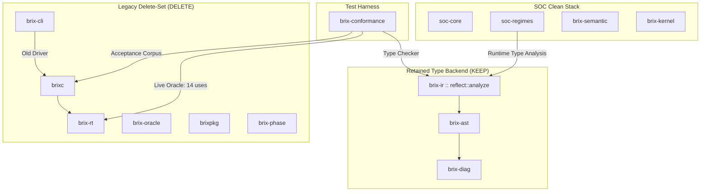
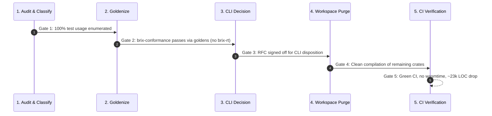

# Spec — Legacy Engine Retirement Plan: Partial Deconstruction and Type-Backend Retention

Status: **Proposed** (governed by [ADR-0002 §12](./adr/ADR-0002_SOC_Constitution.md#12-relationship-to-existing-work); targets workspace bloat and CI compile times while preserving structural type checking).

Date: 2026-07-29.

---

## 1. Context and Motivation

BrixMS has achieved its core architectural milestone: the **SOC Stack** ([`brix-canon`](../crates/brix-canon), [`brix-semantic`](../crates/brix-semantic), [`brix-kernel`](../crates/brix-kernel), [`soc-core`](../crates/soc-core), [`brix-elaborate`](../crates/brix-elaborate)) is completely legacy-clean. Furthermore, the **Proven milestone** (`Derived` → `Audited` → `Proven` end-to-end proof and audit elaboration pipeline) is fully realized and green.

However, the repository retains the legacy v1 engine, which accounts for **~71% of total workspace source LOC (~35,000 LOC)** across 9 crates. In particular, [`brix-rt`](../crates/brix-rt) drags in `wasmtime` and `cranelift` as heavyweight build dependencies, severely impacting CI build times, memory usage, and developer feedback loops. 

As stated in [ADR-0002 §12](./adr/ADR-0002_SOC_Constitution.md#12-relationship-to-existing-work), the legacy engine was retained temporarily as a differential oracle during the transition to the SOC coalgebraic kernel. Now that the kernel is self-consistent and proven, the primary objective is to reclaim workspace bloat and CI compilation overhead by safely retiring the unused portions of the legacy stack.

---

## 2. Key Finding: Load-Bearing Type-Checker Dependency

Initial assumptions held that the legacy engine could be discarded in its entirety once `soc-core` landed. Exhaustive dependency analysis reveals a **load-bearing coupling invariant**:

> **The legacy engine is more than a differential oracle.**
> `soc-regimes`' structural (type) regime directly consumes `brix_ir::reflect::analyze` (the legacy type-inference engine) at runtime, along with `brix-ir`'s intermediate representation and core types (`core::Expr`, `types::Ty`, `frontend::FrontendSource`).

The SOC stack currently delegates type inference to `brix-ir` rather than reimplementing type analysis natively. Consequently, while the SOC stack can settle configurations, audit decompositions, and prove kernel theorems, **it cannot execute type-checking without `brix-ir`**.

### Parse Boundary Confirmation
Critically, investigation of the boundary confirms that `soc-regimes` has **no dependency on [`brixc`](../crates/brixc)** (the legacy text parser/compiler frontend). `soc-regimes` consumes a pre-structured `FrontendSource` data structure; `brix-ir` operates directly on structured AST nodes and never parses raw text source code. 

Therefore, the type-analysis pipeline requires **`brix-ir` + `brix-ast` + `brix-diag`**, but does **not** require the legacy parser (`brixc`), WASM runtime (`brix-rt`), oracle harness (`brix-oracle`), package manager (`brixpkg`), compilation pipeline (`brix-phase`), or legacy CLI (`brix-cli`).

---

## 3. Coupling Map and Blocker Analysis

The legacy codebase consists of two distinct categories: the retained type-checker backend and an interdependent cluster of runtime/compiler crates.

### Identified Blockers & Coupling Points
1. **Deep / Runtime Coupling**: `soc-regimes` $\to$ `brix-ir` (`reflect::analyze` + `core::Expr` + `types::Ty` + `frontend::FrontendSource`). This is a hard structural blocker preventing full deletion of `brix-ir`.
2. **Test Harness Coupling**: `brix-conformance` invokes:
   - `brix_ir::reflect::analyze` for type-system conformance (KEPT).
   - `brix_rt::engine` across 14 test cases as a live settlement differential oracle (BLOCKER — must be goldenized).
   - `brixc` to parse `.brix` source files in the legacy acceptance corpus (BLOCKER — test corpus must be retired or frozen).
3. **Product Boundary**: `brix-cli` wraps the legacy compiler and runtime for command-line execution (BLOCKER — requires product disposition).
4. **Interdependent Cluster**: `brixc`, `brix-rt`, `brix-oracle`, `brixpkg`, `brix-cli`, and `brix-phase` form a tightly coupled web. None of these are referenced by `soc-core` or `soc-regimes`.

---

## 4. Architectural Scopes: PARTIAL vs. FULL

To balance risk, immediate CI performance gains, and long-term architectural purity, two scopes are defined.

### 4.1 Scope 1: PARTIAL (Recommended Target for This Plan)
- **Target**: Delete the legacy execution runtime, compiler, CLI, and oracle while retaining the type-inference engine (`brix-ir` + `brix-ast` + `brix-diag`).
- **Retained Crates**: `brix-ir`, `brix-ast`, `brix-diag` (~12,000 LOC).
- **Deleted Crates**: `brixc` (~8.4k), `brix-rt` (~5.1k), `brix-oracle` (~3.2k), `brixpkg` (~2.7k), `brix-cli` (~3.2k), `brix-phase` (~0.5k) $\approx$ **23,100 LOC deleted**.
- **Impact**:
  - Eliminates `brix-rt` and its transitive dependencies (`wasmtime`, `cranelift`, `wasmtime-wasi`).
  - Speeds up workspace CI compilation dramatically.
  - Retains full structural type checking within `soc-regimes` without needing a complex rewrite.
- **Prerequisite**: Goldenize the `brix_rt::engine` settlement differential in `brix-conformance` by freezing `soc-core`'s validated outputs into golden vectors, allowing `soc-core` to self-validate offline. Retire the `brixc` acceptance test corpus.

### 4.2 Scope 2: FULL (Future Unscheduled Arc)
- **Target**: Reimplement type analysis natively within the SOC stack (completing the self-hosting goal of issue #15 via a native ~8,000 LOC type-checker in `soc-regimes`/`brix-semantic`).
- **Action**: Decouple `soc-regimes` from `brix-ir` entirely and delete all remaining legacy crates (`brix-ir`, `brix-ast`, `brix-diag`).
- **Impact**: Achieves 100% legacy elimination (~35,000 LOC total deleted), leaving only clean SOC architecture.
- **Status**: Deferred to a future separate epic after PARTIAL scope is fully verified.

---

## 5. Crate Disposition (KEEP / DELETE Table)

The workspace crate inventory is categorized below under the **PARTIAL** scope plan:

| Crate | Est. LOC | Disposition | Category / Role | Rationale & Dependencies |
|---|---|---|---|---|
| [`brix-ir`](../crates/brix-ir) | ~8,000 | **KEEP** | Type Backend | Exposes `reflect::analyze`, `core::Expr`, `types::Ty`. Required by `soc-regimes`. |
| [`brix-ast`](../crates/brix-ast) | ~3,500 | **KEEP** | Type Backend | AST node structures required by `brix-ir`. |
| [`brix-diag`](../crates/brix-diag) | ~500 | **KEEP** | Type Backend | Diagnostic primitives required by `brix-ast` and `brix-ir`. |
| [`brixc`](../crates/brixc) | ~8,400 | **DELETE** | Legacy Frontend | Compiler & text parser. Unused by `soc-regimes` (which uses structured input). |
| [`brix-rt`](../crates/brix-rt) | ~5,100 | **DELETE** | Legacy Runtime | WASM execution runtime. Source of `wasmtime`/`cranelift` build bloat. Replaced by goldens. |
| [`brix-oracle`](../crates/brix-oracle) | ~3,200 | **DELETE** | Legacy Oracle | Reference differential runner. Superseded by `soc-core` golden self-validation. |
| [`brix-cli`](../crates/brix-cli) | ~3,200 | **DELETE** | Legacy Product | CLI frontend for legacy engine. Flagged for retirement or minimal SOC replacement. |
| [`brixpkg`](../crates/brixpkg) | ~2,700 | **DELETE** | Legacy Packaging | Package manager and lockfile parser. Unused in SOC stack. |
| [`brix-phase`](../crates/brix-phase) | ~500 | **DELETE** | Legacy Pipeline | Compilation phase pipeline manager. Unused in SOC stack. |

**Total Net LOC Reduction**: $\approx$ **23,100 LOC deleted** (~66% of legacy codebase).

---

## 6. Execution Sequence and Gated Verification

The retirement of the delete-set crates must follow a strict 5-step gated execution sequence to ensure zero breakages in SOC settlement and verification.

### Step 1: Enumerate and Classify Conformance Tests
- **Action**: Inspect every test module in `brix-conformance` that references `brix_rt::engine` or `brixc`.
- **Classification Rules**:
  - *Settlement Differential Tests (14 uses)* $\to$ Mark for **Goldenization** (capture inputs/outputs of `soc-core`).
  - *Old-Compiler Acceptance Tests (`.brix` parsing)* $\to$ Mark for **Retirement** (drop or archive as historical corpus).
- **Gate 1**: 100% of tests in `brix-conformance` cataloged with explicit goldenize vs. drop classifications.

### Step 2: Goldenize Settlement Differential
- **Action**: Freeze current outputs generated by `soc-core` (which were previously verified against `brix_rt::engine`) into versioned, content-addressed JSON/binary golden vector files in `crates/soc-core/tests/goldens/`.
- **Refactor**: Update `brix-conformance` so `soc-core` tests validate directly against these frozen golden vectors without instantiating `brix_rt::engine`.
- **Gate 2**: `cargo test -p brix-conformance` passes 100% green with zero calls to `brix_rt` or `brixc`.

### Step 3: Product Decision on CLI Disposition
- **Action**: Decide whether to retire `brix-cli` completely or replace it with a lightweight SOC CLI wrapper that exposes `soc-core` and `soc-regimes`. (See §7).
- **Gate 3**: Signed-off decision record / RFC on `brix-cli` disposition.

### Step 4: Workspace Deconstruction
- **Action**:
  1. Remove `crates/brixc`, `crates/brix-rt`, `crates/brix-oracle`, `crates/brixpkg`, `crates/brix-cli`, and `crates/brix-phase` from the filesystem.
  2. Remove deleted crates from root `Cargo.toml` (`workspace.members`) and clean up `Cargo.lock`.
  3. Remove `wasmtime`, `wasmtime-wasi`, `wit-bindgen`, and `toml` from `[workspace.dependencies]` in root `Cargo.toml` if no longer referenced.
  4. Verify that `brix-ir`, `brix-ast`, and `brix-diag` compile cleanly alongside `soc-core` and `soc-regimes`.
- **Gate 4**: `cargo check --workspace` succeeds with remaining members (`brix-canon`, `brix-semantic`, `brix-kernel`, `soc-core`, `soc-regimes`, `brix-elaborate`, `brix-diag`, `brix-ast`, `brix-ir`, `sdk/brix-driver-rs`).

### Step 5: Verification & CI Validation
- **Action**: Execute full test suite and audit build tree.
- **Verification Directives**:
  - Confirm `cargo test --workspace` passes cleanly.
  - Verify that `wasmtime` and `cranelift` are no longer downloaded or compiled during CI runs.
  - Confirm source code reduction of $\approx 23,100$ LOC.
- **Gate 5**: Clean workspace build + test pass; zero WASM engine compile overhead in CI; verified LOC drop.

---

## 7. Open Decisions

1. **`brix-cli` Disposition**:
   - *Option A (Retire)*: Delete `brix-cli` completely. CLI interaction for BrixMS is deferred until the SOC stack defines a dedicated command-line interface.
   - *Option B (Minimal SOC CLI)*: Replace `brix-cli` with a lightweight binary (~300 LOC) that exposes `soc-core` configuration loading and settlement execution directly.
   - *Recommendation*: Option A for immediate bloat reduction; Option B can be spawned as a clean SOC crate (`soc-cli`) if required by product.

2. **Timeline for FULL Scope (Native Type Checker)**:
   - Decoupling `soc-regimes` from `brix-ir` requires writing a native ~8,000 LOC type-inference checker inside `soc-regimes` or `brix-semantic`.
   - *Decision*: Treat PARTIAL scope as the immediate production milestone. Schedule FULL scope as a separate proposal when self-hosting requirement (#15) is prioritized.

---

## 8. Summary

Retire ~23,100 LOC of legacy runtime, compiler, oracle, packaging, and CLI crates (`brixc`, `brix-rt`, `brix-oracle`, `brixpkg`, `brix-cli`, `brix-phase`) by goldenizing the settlement differential in `brix-conformance`, while retaining `brix-ir`, `brix-ast`, and `brix-diag` as the non-parsing type-checker backend required by `soc-regimes`.
